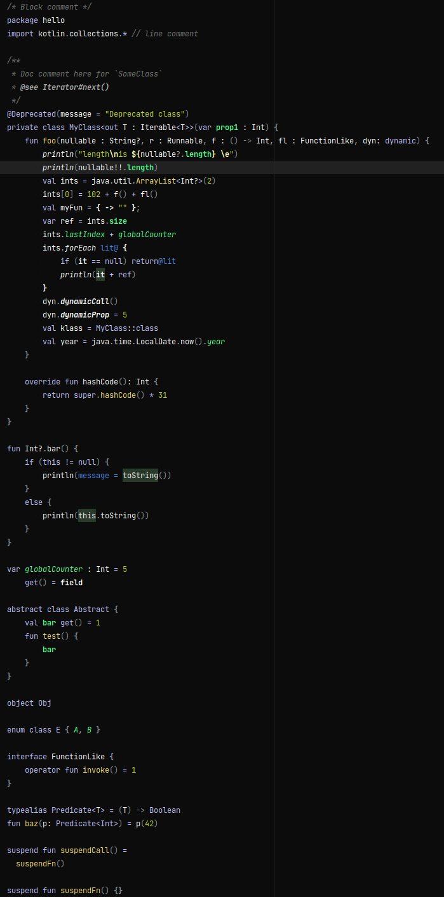
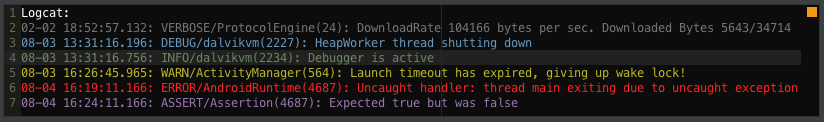
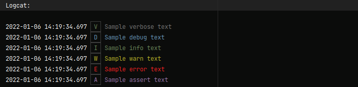

# intellij-colorblind-scheme
A custom designed colors-scheme for Jetbrains Intellij IDEA for color blind folks!

# About
I'm a color blind dev so finding an ideal color scheme for an IDE have been close to hopeless.
So I've spent some time creating my own. It's setup with mostly Java/Android in mind, but other languages should work out-of-the-box as well.
It's doesn't nescessarily look nice to you, but I like it :-)

# Examples
### Java

### Kotlin

### LogCat v1

### LogCat v2

### Groovy

### Language Defaults

### General

### Console

# Installation
Go to Settings/Preferences -> Editor -> Color Scheme -> Gear Icon -> Import Scheme -> Intellij IDEA color scheme (.icls) and then select `ColorBlind.icls`.
