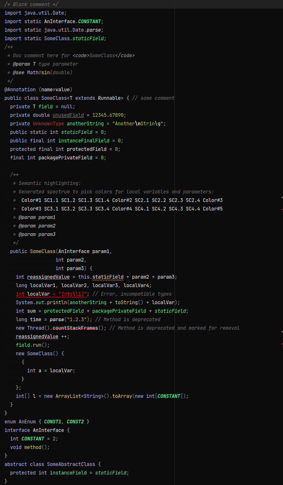

# intellij-colorblind-scheme
A custom designed colors-scheme for Jetbrains Intellij IDEA for color blind folks!

# About
I'm a color blind dev so finding an ideal color scheme for an IDE have been close to hopeless.
So I've spent some time creating my own. It's setup with mostly Java/Android in mind, but other languages should work out-of-the-box as well.
It's doesn't nescessarily look nice to you, but I like it :-)

# Examples
### Java

### Kotlin

### LogCat output

### Groovy

### Language Defaults

### General

### Console

# Installation
Copy `ColorBlind.icls` to `~/Library/Preferences/{IdeaIC12, IntelliJIdea12, appCode20, AndroidStudio}/colors`
